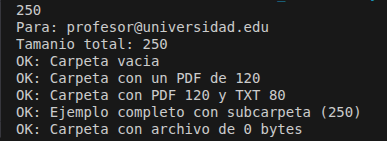
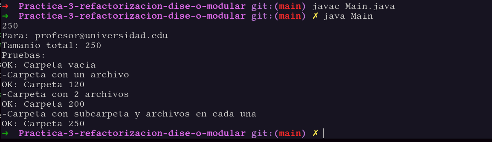
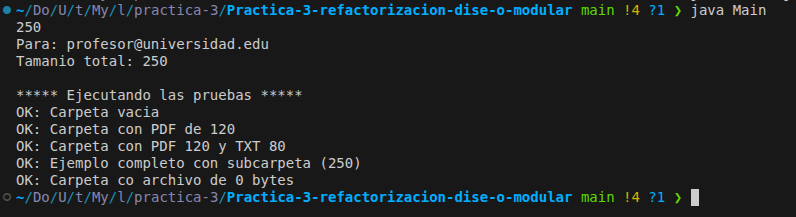

<pre>
Universidad Nacional Autónoma de México
Facultad de Ciencias  Ciencias de la Computación
Modelado y Programación
Práctica 03. Refactorización
</pre>

En este archivo se explicarán algunas etapas del proceso de refactorización que se realizó en esta práctica.

---
# Etapa 1. ¿Qué hace cada parte?
* **El método `agregarArchivo()` se encarga de:** 

    Lo que hace el metodo agregarArchivo es que recibe una carpeta, recibe el tipo de archivo, el nombre del archivo y su tamaño. Si el tipo de documento es .pdf, entonces se añade como justo, un tipo de archivo pdf en la carpeta que se indicó en la entrada. Si es de tipo .txt entonces se añade como un tipo de archivo .txt en la carpeta que se indicó en la entrada
    El método no devuelve nada.

* **El método `obtenerTamanio()` se encarga de:**

    Lo que hacer el metodo de obtenerTamanio es que recibe una carpeta y declara una variable que se llama total y la inicializa en 0. A partir de un for each, recorre todos los archivos de la carpeta, accede al tamaño de cada archivo y lo suma en la variable total pero, tambien la carpeta puede tener subcarpetas, y es necesario obtener tambien el tamaño de esas subcarpetas para sumarlas al total y eso es lo que hace el segundo for each, recorre las subcarpetas que tiene, obtiene su tamaño y lo suma a la variable total. Devuelve el valor de la variable total.

* **El método `enviarResultado()` se encarga de:**

    Recibe una carpeta y una cadena llamada destino, envia un correo electronico al destino, que ahora entendemos que debe de ser un correo electronico. En dicho correo electronico se envia el tamaño total de la carpeta que se indicó. No devuelve nada.     

* **Tres problemas concretos:**

    1. No existe un método que permita crear subcarpetas. Hacer el método para crear la subcarpeta.    

    2. Si quieremos un meter un archivo de tipo .jpg, tendremos que crear una clase padre en la que crearemos archivos de tipo genérico, y que además, implemente una interfaz, y dicha interfaz tendrá un método crearArchivo(). La clase padre, tendrá hijos, y cada uno de ellos se centrará en un tipo de archivo, ya sea .txt, .md, .pdf, etc, etc. Y además, estos hijos, deberan de implementar la interfaz.
    
    3. Separar las clases, pues lo más óptimo no será tener todo en un solo archivo, pues hace más difícil su lectura y es en parte, una mala práctica
---

# Etapa 2. Prueba de ejecución
Se muestra las pruebas antes de realizar cualquier cambio al código.

---

# Etapa 3. Prueba de ejecución
Para esta etapa, se mostrará que después de los cambios realizados en el código, la ejecución sigue mostrando los resultados esperados.

---
# Etapa 4. Prueba de ejecución
Mostramos que después de aplicar Factory Method al código, los resultados se mantienen iguales.

